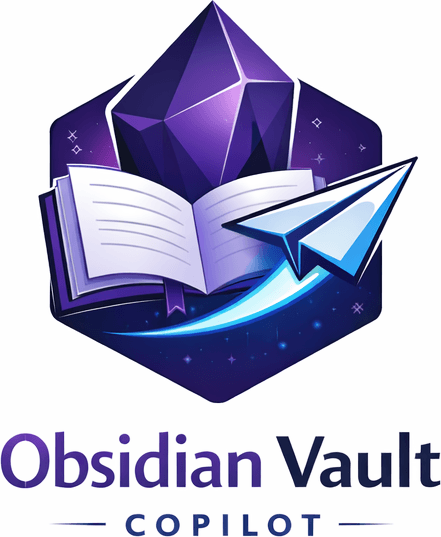
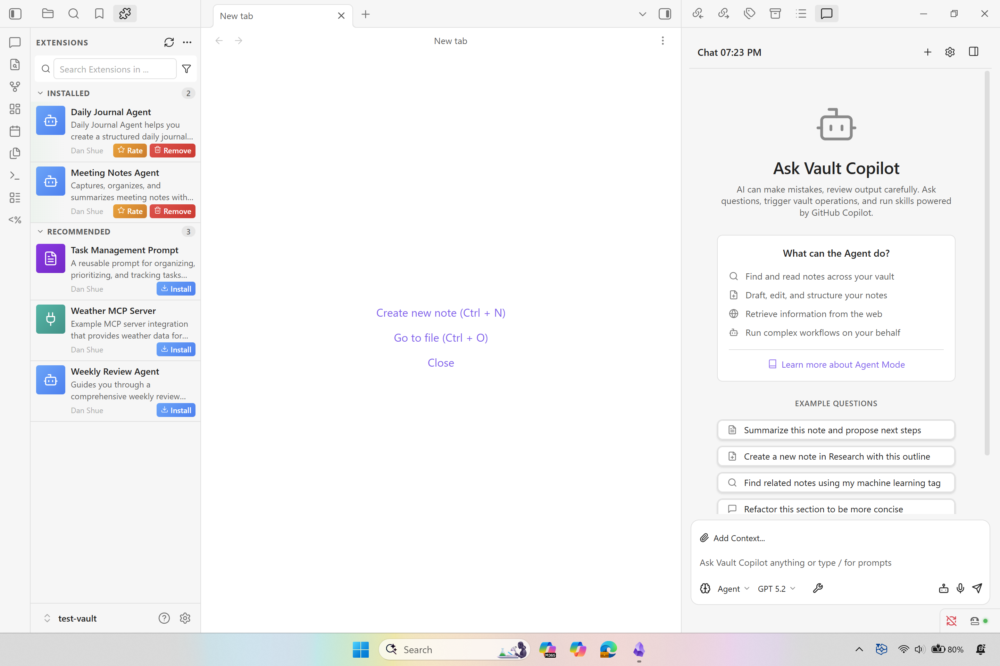

# Vault Copilot


Vault Copilot is an unofficial Obsidian plugin that brings AI-powered assistance to your entire vault. It uses the GitHub Copilot CLI SDK as its foundation, which allows the plugin to communicate with your GitHub Copilot account and execute advanced operations through a skill-based architecture.

Vault Copilot is more than a simple bridge to your notes. It provides an extensible skill system that lets the AI interact with your Obsidian workspace, including searching notes, reading and modifying content, generating new files, organizing information, and working with structured or unstructured context from across your vault.

The plugin is built for extensibility. It supports Model Context Protocol (MCP), which allows developers to expose their own tools, APIs, commands, or workflows as additional skills that Vault Copilot can use. Third-party Obsidian plugins can also register their own capabilities, allowing the AI to interact with features provided by other plugins.

With this foundation, Vault Copilot becomes a flexible reasoning and automation layer inside Obsidian. You can ask questions, draft or rewrite content, trigger vault operations, coordinate workflows that span multiple plugins, and extend the system with your own tooling as your needs grow.

Vault Copilot is a community project and is not affiliated with, sponsored by, or endorsed by Microsoft or GitHub. An active GitHub Copilot subscription is required for AI features.



*The screenshot shows Vault Copilot in action. The chat interface allows you to converse with Vault Copilot, attach notes for context, give it commands against your vault, and receive streaming responses.*

## Features

### AI-Powered Chat
Have natural conversations with GitHub Copilot directly inside Obsidian. Ask questions, explore ideas, analyze content, and draft or rewrite text using a conversational interface.

### Note Context Attachment
Attach notes to a conversation so the model can use their content for more accurate and context-aware responses. Useful for research, documentation, journaling, or large project work.

### Vault Integration
Vault Copilot can read, search, create, modify, and organize notes inside your vault. These operations are exposed as structured skills that the AI can call when needed.

### Extensible Skills System
Vault Copilot exposes a flexible skill layer that allows the AI to perform structured operations. You can add your own skills or extend existing ones to support new workflows.

### Agent Skills Support
Vault Copilot supports Agent Skills, a feature that allows GitHub Copilot to load domain-specific workflows when they are relevant to the task at hand. Agent Skills are folders that contain instructions, scripts, and resources that Copilot automatically loads when the content matches your prompt. GitHub describes Agent Skills as a way to teach Copilot how to perform specialized tasks in a specific and repeatable way. They work across the Copilot coding agent, the Copilot CLI, and agent mode in Visual Studio Code Insiders. 

In Obsidian, this means you can create skills that teach Copilot how to work with your vault. For example, you can store skills that describe how your notes are organized, how you structure writing projects, how you manage daily notes, or how you want information to be reformatted. Vault Copilot will use these skills when they are relevant and follow the instructions and examples you provide. This allows you to customize how Copilot interacts with your notes and ensure more consistent and predictable results across your workspace. 

Agent Skills can include step-by-step instructions, templates, transformation patterns, or sample note formats. When a task matches the skill’s purpose, Copilot loads the skill instructions and applies them to your Obsidian vault, which helps maintain your personal style and structure. This gives you a way to teach Copilot how you want things done inside Obsidian instead of relying only on generic AI behavior.

### Powered by the GitHub Copilot CLI SDK
Built on top of the GitHub Copilot CLI SDK, Vault Copilot supports advanced capabilities such as:
- Secure execution of structured commands
- Parameterized and typed tools the model can reliably call
- Context-aware tool selection and multi-step reasoning
- Automatic parsing of arguments, paths, and note operations
- Improved agent behavior due to the SDK’s tool invocation framework

This makes Vault Copilot more predictable, more capable, and safer than traditional prompt-only approaches.

### Model Context Protocol (MCP) Support
Integrate additional tools, APIs, and external systems into Vault Copilot through MCP. This allows the model to work with custom data sources, command handlers, or automation scripts.

### Multiple AI Models
Choose from available models such as GPT-4.1, GPT-4o, Claude, and others provided through your GitHub Copilot account.


## Requirements

- **GitHub Copilot subscription** (Individual, Business, or Enterprise)
- **GitHub Copilot CLI** installed and authenticated
- **Desktop only** (not compatible with Obsidian Mobile)

## Beta Testers

Want to test Vault Copilot before it's available in the Obsidian Community Plugin directory? You can install the plugin directly from GitHub using the **BRAT** (Beta Reviewers Auto-update Tool) Obsidian plugin.

BRAT allows you to install and automatically update beta plugins from GitHub repositories. Once configured, you'll receive updates as soon as new versions are released.

For detailed step-by-step instructions, troubleshooting tips, and update procedures, see the [BRAT Installation Guide](docs/BRAT.md).

## Developers

Vault Copilot provides an extensible API for third-party Obsidian plugins. You can:

- **Register Skills**: Define custom tools that the AI assistant can invoke on behalf of users
- **Configure MCP Servers**: Add Model Context Protocol servers to extend capabilities
- **Listen to Events**: React to skill registration changes in real-time

Registered skills appear in the Vault Copilot settings panel, and the AI automatically discovers and uses them when relevant to user requests.

For implementation details, TypeScript types, and code examples, see the [Developer API Documentation](docs/developer-api.md).

### Automation packaging

If you are creating automation extensions, package them as markdown automation files:

- Use extension type `automation` in `manifest.json`
- Place automation packages under `extensions/automations/<extension-id>/`
- Include a single primary automation file named `<extension-id>.automation.md`
- Define automation behavior in YAML frontmatter (`name`, `enabled`, `run-on-install`, `triggers`, `actions`)
- Automation installs to `.obsidian/automations/` in the target vault

Example:

```json
// manifest.json
{
	"id": "daily-review",
	"type": "automation",
	"files": [
		{
			"source": "daily-review.automation.md",
			"installPath": ".obsidian/automations/"
		}
	]
}
```

```markdown
---
name: Daily review
enabled: true
run-on-install: false
triggers:
	- type: schedule
		schedule: "0 17 * * 1-5"
actions:
	- type: run-prompt
		promptId: daily-review
		input:
			task: "Create a review note at Daily Notes/{{date:YYYY-MM-DD}}-review.md"
---
```

See the contributor workflow in [CONTRIBUTING.md](CONTRIBUTING.md) and working examples in [test-vault/automations/README.md](test-vault/automations/README.md).

## Contributing
Contributions are welcome! Please read our Contributing Guide for details on our code of conduct and the process for submitting pull requests.

## License
This project is licensed under the [MIT](https://danielshue.github.io/obsidian-vault-copilot/LICENSE) License - see the LICENSE file for details.

## Acknowledgments
Built with GitHub Copilot CLI and GitHub Copilot CLI SDK

## Author
Dan Shue - [GitHub](https://github.com/danielshue)
