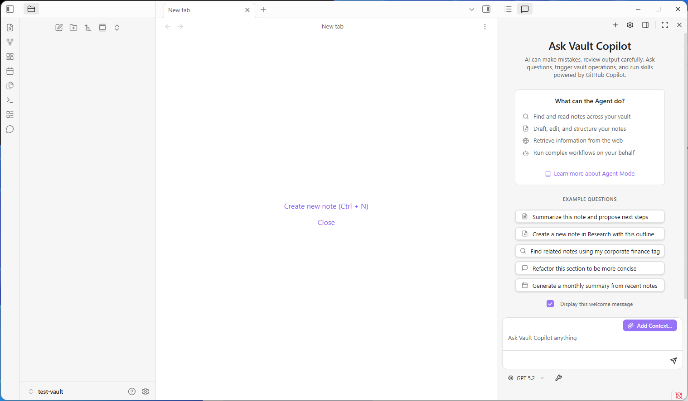

## Overview

Vault Copilot is an enterprise‑ready chat experience embedded directly in Obsidian, built on [GitHub Copilot CLI](https://github.com/features/copilot/cli/). It enables users to work with their Markdown notes using natural language while grounding responses in real context from local files, the web, and Microsoft 365.

The solution is local‑first and file‑based, allowing knowledge to remain portable, auditable, and under user control. Vault Copilot supports repeatable enterprise workflows such as meeting follow‑ups, research capture, and status rollups by synthesizing information across multiple notes and external sources.

When integrated with [Work IQ](https://learn.microsoft.com/en-us/microsoft-365-copilot/extensibility/workiq-overview), Vault Copilot can enrich conversations with permission‑aware Microsoft 365 context including meetings, emails, tasks, and calendars. This allows collaboration signals to be transformed into structured notes and actionable summaries inside Obsidian.

Vault Copilot uses the [GitHub Copilot CLI SDK](https://github.com/github/copilot-sdk) to build grounded, secure, and reusable AI experiences that fit naturally into existing enterprise knowledge workflows.

<video width="640" height="360" controls>
<source src="https://cdn.jsdelivr.net/gh/danielshue/obsidian-vault-copilot@main/src/docs/videos/Vault-Copilot-Intro.mp4" type="video/mp4">
Your browser does not support the video tag
</video>

---

## Features

- Chat interface directly in the popular [Obsidian](https://obsidian.md/) note‑taking app.
- GitHub Copilot–powered conversational responses  
- Contextual grounding from local notes and the web  
- Optional integration with Microsoft 365 via Work IQ 
- Local, file‑based workflow centered on Markdown  

Vault Copilot works alongside your existing notes without changing how they are stored or organized.

---

## Chat Context Tools

Vault Copilot includes a small set of built‑in tools that help bring the right context into chat when needed. These tools are used automatically to support natural conversations.

- **get_active_note**  
  Gets the currently open note to provide immediate context.

- **open_note**  
  Opens a note in the editor when navigating or switching context.

- **batch_read_notes**  
  Reads multiple notes at once to support comparison and synthesis.

- **create_note**  
  Creates a new note in the vault. Vault Copilot always previews the content and asks for your confirmation before writing.

- **update_note**  
  Replaces the content of an existing note. As with creation, Vault Copilot shows you exactly what will change and waits for your approval.

- **fetch_web_page**  
  Fetches and extracts content from a specific web page.

- **web_search**  
  Searches the web to bring in up‑to‑date information.

Together, these tools allow Vault Copilot to read, create, and update notes while combining local vault context with lightweight web grounding so responses stay aligned with what you are working on.

> **Write Safety:** Before creating or updating any note, Vault Copilot always previews the full content in chat and asks for your explicit confirmation. No changes are made to your vault without your approval.

---

## Microsoft 365 Integration (Work IQ)

Vault Copilot can optionally integrate with **Work IQ** to enrich conversations with contextual signals from Microsoft 365.

When enabled, this allows Vault Copilot to reference:
- Meetings and meeting summaries
- Emails and communication context
- Tasks and follow‑ups
- Calendar information

Work IQ integration is read‑only and permission‑aware, ensuring that Vault Copilot respects existing Microsoft 365 security and access controls.

This makes it possible to turn collaboration context into structured notes, summaries, and follow‑ups directly inside Obsidian.

---

## Using GitHub Copilot

Vault Copilot is designed to work with GitHub Copilot in a flexible way.

Depending on your situation, you can:
- Use an existing GitHub Copilot subscription you already have  
- Sign in with a new GitHub Copilot subscription  
- Rely on available free usage if your usage is light  

This makes it easy to try Vault Copilot without changing how you currently access GitHub Copilot.

---

## Why Vault Copilot?

Many people want AI assistance close to their notes without introducing a new application or workflow.

Vault Copilot keeps AI where you already work:
- Inside your editor  
- Next to your writing  
- Grounded in real context from notes and collaboration tools  

This makes it suitable for both individual knowledge management and repeatable enterprise workflows.

---

## How does it work?

At a high level:

- Obsidian provides the editor and vault  
- GitHub Copilot provides the conversational intelligence  
- Vault Copilot brings in relevant context from notes, the web, and Microsoft 365 when appropriate  

You type a message, Vault Copilot gathers the necessary context, and Copilot responds with grounded, actionable output.

---

## Example Uses

- Summarize or rewrite a note you are working on  
- Compare multiple notes and produce a combined outline  
- Turn meeting context into structured notes  
- Brainstorm ideas while drafting content  
- Research a topic and capture key takeaways alongside your notes  

---

## Installation

### Prerequisites

- Obsidian installed on your machine
- GitHub Copilot access and GitHub Copilot CLI installed and configured on your machine

### Install using BRAT (Recommended)

Vault Copilot can be installed directly from GitHub using the **BRAT** (Beta Reviewers Auto‑update Tool) plugin for Obsidian.

1. Install the **BRAT** plugin from the Obsidian Community Plugins browser.
2. Open Obsidian settings → BRAT.
3. Add this repository as a beta plugin:
   - Repository: `danielshue/obsidian-vault-copilot`
4. Enable the Vault Copilot plugin in Obsidian.
5. Open the Vault Copilot chat panel and start chatting.

BRAT allows you to receive updates directly from the repository without manual builds.

---

## License

MIT
