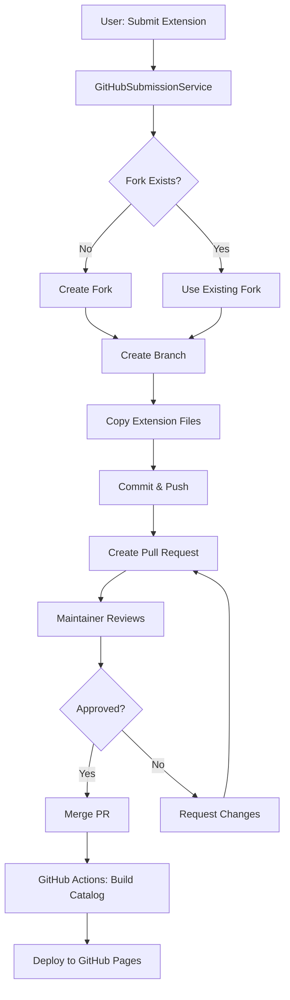
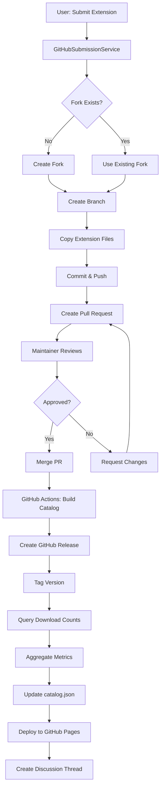

# GitHub Download Analytics: Pros, Cons, and Impact Analysis

**Date:** 2026-02-08  
**Status:** Analysis  
**Context:** Evaluating GitHub-based download tracking for extensions and its impact on the PR-based submission workflow

---

## Executive Summary

This document analyzes the pros and cons of using GitHub for download analytics in the Vault Copilot extension marketplace, with a focus on how it impacts the release process—specifically the automated PR submission workflow implemented in `GitHubSubmissionService`.

**Key Finding:** Using GitHub for analytics is feasible and aligns well with the current PR-based submission workflow, but has important trade-offs around granularity, real-time data, and user privacy that need to be carefully considered.

---

## Current Architecture Context

### Extension Submission Workflow

The plugin currently uses a **PR-based submission workflow**:

1. **User submits extension** via `ExtensionSubmissionModal` in the plugin
2. **GitHubSubmissionService** orchestrates GitHub operations:
   - Validates extension files and manifest
   - Creates/updates fork of `danielshue/obsidian-vault-copilot`
   - Creates branch (`add-{id}` or `update-{id}`)
   - Copies extension files to `extensions/{type}/{id}/`
   - Commits, pushes, and creates Pull Request
3. **Maintainer reviews and merges PR**
4. **GitHub Actions** builds catalog.json and deploys to GitHub Pages
5. **Users install** extensions via the Extension Browser in the plugin

### Current Analytics Gap

Currently, there is **no tracking mechanism** for:
- Number of downloads/installs per extension
- User ratings or feedback
- Extension popularity metrics
- Version-specific adoption

The marketplace documentation mentions ratings as a **future enhancement** (Phase 2), suggesting use of:
- GitHub Reactions initially
- Azure Functions for full 1-5 star ratings later

---

## Proposed: GitHub-Based Analytics

### Architecture Options

#### Option A: GitHub Release Downloads
- Track downloads via GitHub Releases for each extension
- Each extension version creates a release with downloadable assets
- Use GitHub API to query download counts

#### Option B: GitHub Pages Analytics
- Extensions downloaded from GitHub Pages URLs
- Track via external analytics (Google Analytics, Plausible, etc.)
- Or use GitHub's own traffic analytics

#### Option C: GitHub API + Catalog Metadata
- Store download counts in catalog.json
- Update via GitHub Actions workflow that:
  - Queries GitHub API for release download counts
  - Aggregates data
  - Updates catalog.json with metrics

#### Option D: GitHub Discussions + Reactions
- Use GitHub Discussions for each extension
- Track engagement via reactions (👍 = upvote, ⭐ = favorite)
- Convert reactions to rating scores

---

## Pros of Using GitHub for Analytics

### ✅ 1. Zero Additional Infrastructure

**Benefit:** Leverages existing GitHub infrastructure without requiring external services.

- No need to deploy Azure Functions, databases, or serverless APIs
- No additional costs for hosting analytics backend
- No maintenance burden for separate systems
- Aligns with "GitHub-native" approach already used for submissions

**Impact on Release Process:**
- Minimal change to PR workflow
- GitHub Actions can aggregate metrics automatically during catalog build
- No authentication complexity (already using GitHub CLI)

---

### ✅ 2. Tight Integration with PR Workflow

**Benefit:** Analytics naturally flows from the PR-based submission process.

**How it works:**
1. Extension submitted via PR to main repo
2. PR merged → GitHub Actions triggers
3. Actions workflow:
   - Builds catalog.json
   - Creates GitHub Release (if using Option A)
   - Updates download tracking metadata
   - Deploys to GitHub Pages

**Impact on Release Process:**
- **Seamless automation**: GitHub Actions already run on PR merge
- **Version tracking**: Each PR merge = new version = new release
- **Audit trail**: All releases visible in GitHub UI
- **No manual steps**: Metrics update automatically

---

### ✅ 3. Transparency and Auditability

**Benefit:** All analytics data is publicly visible and auditable.

- Download counts visible in GitHub Releases UI
- Community can see extension popularity
- No "black box" analytics
- Builds trust with users

**Impact on Release Process:**
- PR descriptions can reference previous download counts
- Maintainers can prioritize reviews based on popularity
- Community can validate metrics

---

### ✅ 4. GitHub Reactions for Ratings (Simple Start)

**Benefit:** Start with simple engagement metrics without building a ratings backend.

**Implementation:**
- Each extension gets a GitHub Discussion thread
- Users react with 👍, ❤️, 🎉, 👀, etc.
- Build script aggregates reactions into a score
- Display in extension cards

**Mapping reactions to ratings:**
```typescript
// Example scoring algorithm
const reactionWeights = {
  '+1': 1.0,      // Thumbs up
  'heart': 1.0,   // Love
  'hooray': 0.8,  // Party
  'eyes': 0.3,    // Watching/interested
  'confused': -0.5,
  '-1': -1.0      // Thumbs down
};

function calculateRating(reactions: Reactions): number {
  const totalScore = Object.entries(reactions)
    .reduce((sum, [type, count]) => {
      return sum + (reactionWeights[type] || 0) * count;
    }, 0);
  
  const totalReactions = Object.values(reactions)
    .reduce((sum, count) => sum + count, 0);
  
  // Normalize to 1-5 scale
  if (totalReactions === 0) return null;
  
  const normalized = (totalScore / totalReactions + 1) * 2.5;
  return Math.max(1, Math.min(5, normalized));
}
```

**Impact on Release Process:**
- PR template can include link to Discussion thread
- Maintainers can see community sentiment before merging
- Existing GitHub authentication (via PR submissions)

---

### ✅ 5. GitHub OAuth for User Identity

**Benefit:** Users already authenticate with GitHub for PR submissions.

- No separate login system needed
- GitHub user → hash → rating association (privacy-preserving)
- Users can edit their ratings/comments via GitHub Discussions
- Spam prevention via GitHub's existing systems

**Impact on Release Process:**
- Same authentication flow for submissions and ratings
- User submits extension via PR → same identity for ratings
- Consistent user experience

---

### ✅ 6. Version-Specific Tracking

**Benefit:** GitHub Releases naturally support version-specific downloads.

**Structure:**
```
Extension: daily-journal-agent
├── v1.0.0 Release (120 downloads)
├── v1.1.0 Release (85 downloads)
└── v2.0.0 Release (200 downloads)
```

**Impact on Release Process:**
- Each PR merge creates new release
- Automated via GitHub Actions
- Download counts per version visible
- Can track adoption of updates

---

## Cons of Using GitHub for Analytics

### ❌ 1. Download Count Limitations

**Issue:** GitHub Release download counts have significant limitations.

**Limitations:**
- **Not Real-Time:** Download counts can lag by several hours
- **No Breakdown:** Can't distinguish unique users vs. repeat downloads
- **No Geographic Data:** Can't see where users are located
- **Bot Traffic:** Includes automated tools, CI/CD, etc.
- **Caching:** CDN caching may inflate counts

**Impact on Release Process:**
- Download metrics may not reflect actual user installs
- Can't immediately see impact of new release
- Inflated numbers may mislead maintainers
- Difficult to detect fraud or bot activity

**Example Scenario:**
```
PR merged for daily-journal-agent v2.0.0
GitHub Actions creates Release
GitHub reports: 500 downloads in first hour

Reality:
- 150 actual user installs
- 200 CDN cache fetches
- 100 CI/CD test downloads
- 50 automated scrapers
```

---

### ❌ 2. Installation vs. Download Mismatch

**Issue:** Downloads from GitHub don't equal installations in vaults.

**The Problem:**
1. User downloads extension from GitHub Release
2. Extension installed to vault via `ExtensionManager`
3. GitHub sees download, but doesn't know if it was installed
4. User might download multiple times, install once

**Impact on Release Process:**
- Metrics don't reflect actual usage
- Can't track uninstalls
- Can't measure retention
- No way to know if extension is actively used

**What we actually want to track:**
- ✅ Installations per extension
- ✅ Active installations (not uninstalled)
- ✅ Update adoption rate
- ✅ Installation failures

**What GitHub provides:**
- ❌ Downloads (includes cache, bots, failed installs)

---

### ❌ 3. Privacy Concerns

**Issue:** Tracking user behavior requires careful privacy consideration.

**Concerns:**
- **User Identity:** Tying downloads to GitHub users
- **Vault Data:** Knowing which extensions are in which vaults
- **Usage Patterns:** Tracking when/how often extensions are used
- **GDPR Compliance:** EU users have right to data deletion

**Impact on Release Process:**
- Can't implement personalized recommendations
- Can't track individual user journeys
- Must hash GitHub IDs for privacy (can't reverse lookup)
- Complex data retention policies

**Current Approach in Documentation:**
> "We want to do a hash associated with the GitHub user who provides the rating."

This helps, but:
- Hashing prevents future user lookups
- Can't merge duplicate ratings
- Can't contact users for feedback
- Can't validate ratings (same user, multiple accounts)

---

### ❌ 4. Rate Limiting

**Issue:** GitHub API has strict rate limits.

**Limits (unauthenticated):**
- 60 requests/hour per IP

**Limits (authenticated):**
- 5,000 requests/hour per user

**Impact on Release Process:**
- Catalog build script must be rate-limit aware
- Can't poll GitHub API in real-time
- Must cache aggressively
- Scaling issues if catalog grows large

**Example Scenario:**
```
100 extensions in catalog
Each extension has 5 releases
Need to query 500 endpoints for download counts
= 500 API requests per catalog build

Rate limit: 5,000/hour
Can build catalog ~10 times/hour maximum
```

**Mitigation:**
- Use GitHub Actions with GITHUB_TOKEN (higher limits)
- Cache download counts in catalog.json
- Only update metrics daily or weekly
- Batch API requests efficiently

---

### ❌ 5. No User-Specific Data

**Issue:** GitHub doesn't provide user-specific install tracking.

**What we can't do with GitHub alone:**
- Track which user installed which extension
- Send personalized update notifications
- Recommend extensions based on installed ones
- Track user satisfaction over time
- A/B test extension descriptions

**Impact on Release Process:**
- Can't notify users when updates available
- Can't gather feedback from specific users
- Can't understand user segments
- Can't optimize for different user types

---

### ❌ 6. Complexity of Ratings Implementation

**Issue:** GitHub Reactions are not a true ratings system.

**Problems:**
- **No 1-5 star scale:** Reactions are binary (did react or didn't)
- **Unclear meaning:** Does 👍 mean "5 stars" or "3 stars"?
- **Gaming potential:** Users can react with multiple emojis
- **No editing:** Can't change reaction weight after submitting
- **No comments:** Reactions don't include feedback

**Impact on Release Process:**
- Ambiguous ratings confuse maintainers
- Can't gather actionable feedback
- Difficult to compare extensions fairly
- May need separate feedback mechanism

**Alternative: GitHub Discussions**
- Allow text comments
- Users can provide detailed feedback
- Maintainers can respond
- But: No structured rating system

---

### ❌ 7. Dependency on GitHub Availability

**Issue:** If GitHub goes down, analytics go down.

**Scenarios:**
- **GitHub Outage:** Can't fetch download counts
- **API Changes:** Breaking changes to GitHub API
- **Rate Limit Exceeded:** Metrics stop updating
- **Repository Deleted:** All history lost

**Impact on Release Process:**
- Catalog builds fail if GitHub API is down
- No fallback for metrics
- Must handle API errors gracefully
- Need backup data source

---

## Impact on Release Process

### Current PR Submission Workflow



### Enhanced Workflow with GitHub Analytics



### Changes Required

#### 1. GitHubSubmissionService Enhancements

**Add Release Creation Step:**

```typescript
// In GitHubSubmissionService.ts
async submitExtension(params: ExtensionSubmissionParams): Promise<SubmissionResult> {
  // ... existing validation, fork, branch, copy, commit, push logic ...
  
  // Create Pull Request
  const prResult = await this.createPullRequest(params);
  
  // NEW: Add note about release creation in PR description
  const enhancedPrDescription = `
${params.prDescription || this.generatePrDescription(params)}

---

### Post-Merge Actions

When this PR is merged, GitHub Actions will automatically:
- Create a GitHub Release for version ${params.version}
- Generate download tracking metrics
- Create a Discussion thread for community feedback
- Update catalog.json with extension metadata

**Analytics:**
This extension will be tracked via GitHub Release downloads and Discussion reactions.
  `;
  
  return {
    success: true,
    pullRequestUrl: prResult.url,
    pullRequestNumber: prResult.number,
    // ... other fields
  };
}
```

#### 2. GitHub Actions Workflow Enhancement

**Add release creation to `build-and-deploy.yml`:**

```yaml
name: Build Catalog and Deploy

on:
  push:
    branches: [master]
  pull_request:
    types: [closed]

jobs:
  build-and-deploy:
    if: github.event.pull_request.merged == true || github.event_name == 'push'
    runs-on: ubuntu-latest
    
    steps:
      # ... existing checkout, build catalog steps ...
      
      # NEW: Create GitHub Release for new/updated extensions
      - name: Create Release for Extensions
        if: github.event.pull_request
        run: |
          # Parse PR to determine affected extensions
          PR_TITLE="${{ github.event.pull_request.title }}"
          
          # Extract extension info from PR title
          # Format: "[Agent] extension-id vX.Y.Z"
          if [[ $PR_TITLE =~ \[(.*)\]\ (.*)\ v([0-9]+\.[0-9]+\.[0-9]+) ]]; then
            EXT_TYPE="${BASH_REMATCH[1]}"
            EXT_ID="${BASH_REMATCH[2]}"
            EXT_VERSION="${BASH_REMATCH[3]}"
            
            # Create release
            gh release create \
              "${EXT_ID}-v${EXT_VERSION}" \
              --title "${EXT_ID} v${EXT_VERSION}" \
              --notes "Extension release from PR #${{ github.event.pull_request.number }}" \
              --discussion-category "Extensions" \
              extensions/${EXT_TYPE,,}s/${EXT_ID}/*
          fi
        env:
          GH_TOKEN: ${{ github.token }}
      
      # NEW: Fetch download counts and update catalog
      - name: Update Download Metrics
        run: node scripts/update-download-metrics.js
        env:
          GH_TOKEN: ${{ github.token }}
      
      # ... existing deploy steps ...
```

#### 3. New Script: `update-download-metrics.js`

```javascript
// scripts/update-download-metrics.js
const { Octokit } = require('@octokit/rest');
const fs = require('fs').promises;

const octokit = new Octokit({ auth: process.env.GH_TOKEN });

async function fetchDownloadCounts() {
  const releases = await octokit.rest.repos.listReleases({
    owner: 'danielshue',
    repo: 'obsidian-vault-copilot',
  });
  
  const downloadCounts = {};
  
  for (const release of releases.data) {
    // Parse release tag: "extension-id-vX.Y.Z"
    const match = release.tag_name.match(/^(.+)-v(\d+\.\d+\.\d+)$/);
    if (!match) continue;
    
    const [, extensionId, version] = match;
    
    const totalDownloads = release.assets.reduce((sum, asset) => {
      return sum + asset.download_count;
    }, 0);
    
    if (!downloadCounts[extensionId]) {
      downloadCounts[extensionId] = {
        totalDownloads: 0,
        versions: {},
      };
    }
    
    downloadCounts[extensionId].totalDownloads += totalDownloads;
    downloadCounts[extensionId].versions[version] = totalDownloads;
  }
  
  return downloadCounts;
}

async function fetchDiscussionReactions() {
  // Query GitHub Discussions API for extension discussion threads
  const discussions = await octokit.graphql(`
    query {
      repository(owner: "danielshue", name: "obsidian-vault-copilot") {
        discussions(first: 100, categoryId: "EXTENSIONS_CATEGORY_ID") {
          nodes {
            title
            reactions(first: 100) {
              nodes {
                content
              }
            }
          }
        }
      }
    }
  `);
  
  const ratings = {};
  
  for (const discussion of discussions.data.repository.discussions.nodes) {
    // Extract extension ID from discussion title
    const extensionId = discussion.title.toLowerCase().replace(/\s+/g, '-');
    
    const reactionCounts = {};
    for (const reaction of discussion.reactions.nodes) {
      reactionCounts[reaction.content] = (reactionCounts[reaction.content] || 0) + 1;
    }
    
    // Calculate rating score
    const rating = calculateRating(reactionCounts);
    ratings[extensionId] = {
      rating,
      reactionCount: discussion.reactions.nodes.length,
      reactions: reactionCounts,
    };
  }
  
  return ratings;
}

function calculateRating(reactions) {
  const weights = {
    THUMBS_UP: 1.0,
    HEART: 1.0,
    HOORAY: 0.8,
    EYES: 0.3,
    CONFUSED: -0.5,
    THUMBS_DOWN: -1.0,
  };
  
  let totalScore = 0;
  let totalCount = 0;
  
  for (const [type, count] of Object.entries(reactions)) {
    const weight = weights[type] || 0;
    totalScore += weight * count;
    totalCount += count;
  }
  
  if (totalCount === 0) return null;
  
  // Normalize to 1-5 scale
  const normalized = ((totalScore / totalCount) + 1) * 2.5;
  return Math.max(1, Math.min(5, normalized));
}

async function updateCatalog() {
  const catalog = JSON.parse(await fs.readFile('catalog/catalog.json', 'utf8'));
  
  const downloadCounts = await fetchDownloadCounts();
  const ratings = await fetchDiscussionReactions();
  
  for (const extension of catalog.extensions) {
    const downloads = downloadCounts[extension.id];
    const rating = ratings[extension.id];
    
    if (downloads) {
      extension.downloads = downloads.totalDownloads;
      extension.downloadsByVersion = downloads.versions;
    }
    
    if (rating) {
      extension.rating = rating.rating;
      extension.ratingCount = rating.reactionCount;
    }
  }
  
  await fs.writeFile(
    'catalog/catalog.json',
    JSON.stringify(catalog, null, 2)
  );
  
  console.log('✅ Catalog updated with download and rating metrics');
}

updateCatalog().catch(console.error);
```

---

## Recommendations

### Phase 1: Start Simple (GitHub Releases + Reactions)

**Timeline:** Immediate

**Implementation:**
1. ✅ Use GitHub Releases for version tracking
2. ✅ Track downloads via GitHub API
3. ✅ Use GitHub Discussions + Reactions for ratings
4. ✅ Update catalog.json daily via GitHub Actions
5. ✅ Display metrics in Extension Browser

**Pros:**
- No additional infrastructure
- Leverages existing PR workflow
- Simple to implement
- Transparent and auditable

**Cons:**
- Download counts are approximate
- Ratings are not true 1-5 stars
- No real-time updates
- Limited user-specific data

**Code Changes:**
- Add release creation to GitHub Actions
- Create `update-download-metrics.js` script
- Update `catalog.json` schema to include metrics
- Enhance Extension Card UI to show downloads/ratings

---

### Phase 2: Hybrid Approach (GitHub + Azure Functions)

**Timeline:** 3-6 months after Phase 1

**Implementation:**
1. ✅ Keep GitHub Releases for version tracking
2. ✅ Add Azure Functions for install tracking
3. ✅ Implement true 1-5 star ratings API
4. ✅ Track actual installations (not just downloads)
5. ✅ Add user-specific data (hashed GitHub IDs)

**Architecture:**

```
Plugin (in vault)
    ↓
    ├─→ Install Extension
    │   ↓
    │   POST /api/installs
    │   {
    │     extensionId: "daily-journal",
    │     version: "1.0.0",
    │     userHash: "sha256(githubId)",
    │     timestamp: "2026-02-08T12:00:00Z"
    │   }
    │
    └─→ Submit Rating
        ↓
        POST /api/ratings
        {
          extensionId: "daily-journal",
          version: "1.0.0",
          rating: 5,
          userHash: "sha256(githubId)",
          comment: "Great extension!"
        }

Azure Functions
    ↓
    ├─→ Store in Azure Table Storage
    └─→ Return aggregated metrics

GitHub Actions (daily)
    ↓
    Fetch metrics from Azure Functions
    ↓
    Update catalog.json
    ↓
    Deploy to GitHub Pages
```

**API Endpoints:**

```typescript
// POST /api/installs
interface InstallEvent {
  extensionId: string;
  version: string;
  userHash: string;  // SHA-256 of GitHub user ID
  timestamp: string;
  platform: 'desktop' | 'mobile';
  vaultCopilotVersion: string;
}

// POST /api/ratings
interface RatingSubmission {
  extensionId: string;
  version?: string;  // Optional: rate specific version
  rating: 1 | 2 | 3 | 4 | 5;
  userHash: string;
  comment?: string;
  timestamp: string;
}

// GET /api/metrics/{extensionId}
interface ExtensionMetrics {
  extensionId: string;
  totalInstalls: number;
  activeInstalls: number;  // Not uninstalled
  averageRating: number;
  ratingCount: number;
  versionBreakdown: {
    [version: string]: {
      installs: number;
      rating: number;
    };
  };
}
```

**Pros:**
- Accurate install tracking
- True 1-5 star ratings
- User-specific data (privacy-preserved)
- Real-time metrics
- Can track uninstalls
- Better analytics for maintainers

**Cons:**
- Requires backend infrastructure
- Azure Functions costs (likely minimal on free tier)
- More complex implementation
- Need to handle authentication
- GDPR compliance considerations

---

### Phase 3: Full Analytics Platform (Future)

**Timeline:** 12+ months

**Features:**
- User segmentation
- Personalized recommendations
- A/B testing
- Conversion funnel tracking
- Retention analysis
- Heat maps of feature usage

**Not recommended initially** due to:
- High implementation cost
- Privacy concerns
- Complexity
- Low ROI for small user base

---

## Decision Matrix

| Feature | GitHub Only | Hybrid (GitHub + Azure) | Full Platform |
|---------|-------------|-------------------------|---------------|
| **Download Tracking** | ⚠️ Approximate | ✅ Accurate | ✅ Accurate |
| **Install Tracking** | ❌ No | ✅ Yes | ✅ Yes |
| **Ratings** | ⚠️ Reactions | ✅ 1-5 Stars | ✅ 1-5 Stars |
| **Comments** | ✅ Discussions | ✅ API + UI | ✅ Advanced UI |
| **Version-Specific** | ✅ Yes | ✅ Yes | ✅ Yes |
| **Real-Time** | ❌ No | ✅ Yes | ✅ Yes |
| **Privacy** | ✅ Public | ⚠️ Hashed IDs | ⚠️ Hashed IDs |
| **Infrastructure Cost** | ✅ Free | ⚠️ Minimal | ❌ High |
| **Implementation Time** | ✅ Days | ⚠️ Weeks | ❌ Months |
| **Maintenance** | ✅ Low | ⚠️ Medium | ❌ High |

---

## Conclusion

**Recommendation: Start with Phase 1 (GitHub Only), evolve to Phase 2 (Hybrid) based on user demand.**

### Why GitHub Works for Now:

1. ✅ **Aligns with PR workflow** - No disruption to submission process
2. ✅ **Zero cost** - Uses existing infrastructure
3. ✅ **Simple implementation** - Can ship in days, not months
4. ✅ **Transparent** - Community can see all metrics
5. ✅ **Extensible** - Easy to migrate to hybrid later

### When to Evolve to Hybrid:

- User base grows beyond 1,000 active users
- Community demands better ratings system
- Need more accurate install tracking
- Want to personalize user experience
- Budget allows for Azure Functions

### Impact on Release Process:

**Minimal disruption:**
- PR workflow remains the same
- GitHub Actions automatically create releases
- Metrics update daily (no real-time requirement)
- Extension Browser shows metrics from catalog.json

**Enhanced workflow:**
- Maintainers see download trends
- Popular extensions get more attention
- Community feedback visible in Discussions
- Version adoption tracked automatically

---

## Next Steps

1. **Immediate:**
   - [ ] Implement GitHub Release creation in Actions
   - [ ] Create `update-download-metrics.js` script
   - [ ] Update catalog.json schema
   - [ ] Add metrics display to Extension Browser UI

2. **Short-term (1-3 months):**
   - [ ] Monitor GitHub API rate limits
   - [ ] Gather user feedback on metrics accuracy
   - [ ] Evaluate need for hybrid approach
   - [ ] Design Azure Functions API if needed

3. **Long-term (6+ months):**
   - [ ] Implement hybrid system if demand exists
   - [ ] Add personalized recommendations
   - [ ] Consider retention tracking
   - [ ] Evaluate full analytics platform

---

**Document Prepared By:** AI Assistant  
**For Review By:** Project Maintainer  
**Status:** Draft - Awaiting Feedback
