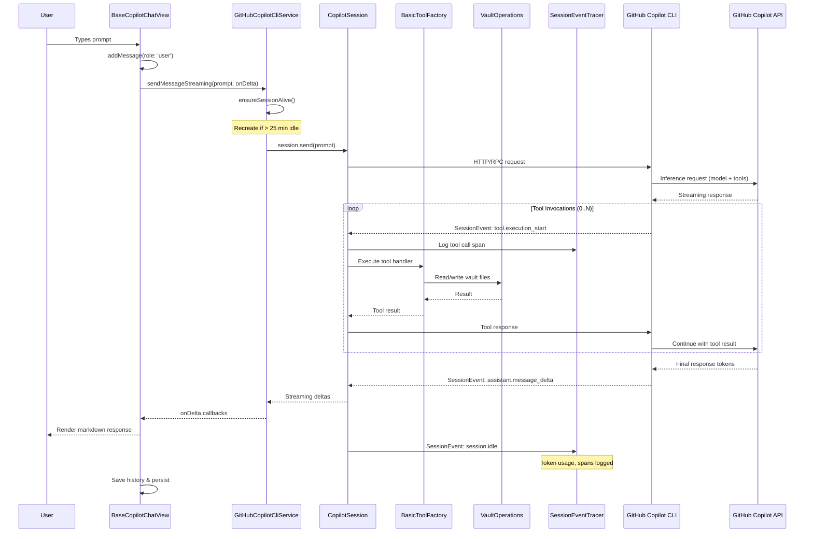

# Vault Copilot — Architecture

GitHub Copilot CLI SDK Integration Focus

```mermaid
graph TB
    %% ─── Title ───
    subgraph OBSIDIAN["Obsidian Host Runtime"]
        OApp["Obsidian App<br/>Workspace / Vault"]
        PluginAPI["Plugin API<br/>onload · onunload"]
        VaultFS["Vault Filesystem<br/>Adapter / Files"]
        SettingsStore["Settings Storage<br/>data.json"]
        CommandPalette["Command Palette<br/>addCommand"]
    end

    subgraph PLUGIN["BasicCopilotPlugin &nbsp;(vault-copilot/src/main.ts)"]
        ChatView["BaseCopilotChatView<br/>Messages · Input · Session Mgr"]
        SettingTab["BasicSettingTab<br/>CLI · Chat · Vault · Help"]

        subgraph EXTAPI["Extension API"]
            ToolReg["ToolRegistry"]
            ViewReg["ViewRegistry"]
            SettingsReg["SettingsRegistry"]
            CmdReg["CommandRegistry"]
            ProviderReg["ProviderRegistry"]
            RenderReg["RenderRegistry"]
            ContextReg["ContextRegistry"]
        end

        CliManager["GitHubCopilotCliManager<br/>Health · Version · Status"]
        Tracing["TracingService<br/>SessionEventTracer"]
        RibbonStatus["Ribbon Icon · Status Bar"]
        AppLogger["AppLogger<br/>.log / .jsonl files"]
    end

    subgraph EXTENSIONS["Pro / 3rd-Party Extensions"]
        ExtSlot["Registers via Extension API<br/>─────────────<br/>• Extra tools 40+<br/>• Agents, MCP, Voice<br/>• Custom prompts<br/>• Additional providers"]
    end

    subgraph SDK["GitHub Copilot CLI SDK Layer &nbsp;(@github/copilot-sdk)"]
        subgraph CliService["GitHubCopilotCliService"]
            Client["CopilotClient ← new CopilotClient·opts·"]
            Session["CopilotSession ← client.createSession·"]
            Methods["start· · stop·<br/>createSession· · resumeSession·<br/>sendMessage· · sendMessageStreaming·<br/>abort· · compactSession·<br/>listModels· → model catalog"]
            Hooks["Template Method Hooks<br/>─────────────<br/>buildTools· → BasicToolFactory<br/>buildSystemPrompt·<br/>buildSummarizer·"]
        end

        subgraph ToolFactory["BasicToolFactory &nbsp;(7 Tools via defineTool)"]
            T1["get_active_note"]
            T2["batch_read_notes"]
            T3["create_note"]
            T4["update_note"]
            T5["open_note"]
            T6["fetch_web_page"]
            T7["web_search"]
            VaultOps["VaultOperations<br/>tool handlers"]
            ToolDefs["ToolDefinitions<br/>JSON schemas"]
        end

        subgraph SessionLife["Session Lifecycle"]
            SCreate["Create / Resume"]
            SIdle["Idle Recovery<br/>25 min threshold"]
            SHistory["History Mgmt"]
            SCompact["Compaction"]
        end

        subgraph SysPrompt["SystemPromptBuilder"]
            SP1["Vault context"]
            SP2["Capabilities"]
            SP3["Write safety"]
            SP4["Date/time"]
        end
    end

    subgraph SDKIMPORTS["SDK Imports &nbsp;(from @github/copilot-sdk)"]
        IClient["CopilotClient"]
        ISession["CopilotSession"]
        IEvent["SessionEvent"]
        IApprove["approveAll"]
        IDefineTool["defineTool"]
    end

    subgraph EXTERNAL["External Process / Network"]
        CliChild["GitHub Copilot CLI<br/>child process / cliUrl"]
        GitHubAPI["GitHub Copilot API<br/>models · inference"]
        MCPServers["CLI MCP Servers<br/>~/.copilot/mcp-config"]
        VaultDisk["Vault on Disk<br/>.md · data.json"]
        WebAPIs["Web APIs<br/>fetch · search"]
    end

    %% ─── Connections ───
    OApp --> PluginAPI
    PluginAPI --> PLUGIN

    ChatView -- "sendMessage·<br/>sendMessageStreaming·" --> CliService
    CliManager -- "health check" --> CliChild
    Tracing -- "mirrors logs" --> AppLogger

    ExtSlot -- "registers tools, views, commands..." --> EXTAPI

    Hooks -- "buildTools·" --> ToolFactory
    Hooks -- "buildSystemPrompt·" --> SysPrompt
    CliService -- "session lifecycle" --> SessionLife

    CliService -- "CopilotClient.start·<br/>spawns child process" --> CliChild
    CliChild -- "HTTP/RPC" --> GitHubAPI
    GitHubAPI -- "MCP tools" --> MCPServers

    VaultOps -- "vault read/write" --> VaultDisk
    T6 -- "fetch" --> WebAPIs
    T7 -- "search" --> WebAPIs

    SDKIMPORTS -.-> CliService

    %% ─── Styling ───
    classDef obsidian fill:#e5dbff,stroke:#7950f2,stroke-width:2px,color:#333
    classDef plugin fill:#a5d8ff,stroke:#1864ab,stroke-width:2px,color:#333
    classDef extapi fill:#d8f5a2,stroke:#5c940d,stroke-width:2px,color:#333
    classDef sdk fill:#ffc9c9,stroke:#c92a2a,stroke-width:2px,color:#333
    classDef tools fill:#fff3bf,stroke:#e67700,stroke-width:2px,color:#333
    classDef tracing fill:#f3d9fa,stroke:#862e9c,stroke-width:2px,color:#333
    classDef session fill:#f3d9fa,stroke:#862e9c,stroke-width:2px,color:#333
    classDef sysprompt fill:#dbe4ff,stroke:#364fc7,stroke-width:2px,color:#333
    classDef imports fill:#ffc9c9,stroke:#c92a2a,stroke-width:1px,color:#333
    classDef external fill:#dee2e6,stroke:#495057,stroke-width:2px,color:#333
    classDef logger fill:#dee2e6,stroke:#495057,stroke-width:2px,color:#333
    classDef extensions fill:#ebfbee,stroke:#5c940d,stroke-width:2px,color:#333

    class OApp,PluginAPI,VaultFS,SettingsStore,CommandPalette obsidian
    class ChatView,SettingTab,RibbonStatus plugin
    class ToolReg,ViewReg,SettingsReg,CmdReg,ProviderReg,RenderReg,ContextReg extapi
    class CliManager tools
    class Tracing tracing
    class AppLogger logger
    class Client,Session,Methods,Hooks sdk
    class T1,T2,T3,T4,T5,T6,T7,VaultOps,ToolDefs tools
    class SCreate,SIdle,SHistory,SCompact session
    class SP1,SP2,SP3,SP4 sysprompt
    class IClient,ISession,IEvent,IApprove,IDefineTool imports
    class CliChild,GitHubAPI,MCPServers,VaultDisk,WebAPIs external
    class ExtSlot extensions
```

## Message Flow

## Legend

| Color | Meaning |
|-------|---------|
| 🟣 Purple | Obsidian Host Runtime |
| 🔵 Blue | Plugin Core (BasicCopilotPlugin) |
| 🟢 Green | Extension API & Extensions |
| 🔴 Red | GitHub Copilot CLI SDK Layer |
| 🟠 Orange | Tools & MCP |
| 🟣 Light Purple | Tracing / Session Lifecycle |
| ⚪ Gray | Logging & External Systems |
