# Mermaid Diagrams

Obsidian renders Mermaid diagrams directly in fenced code blocks with the `mermaid` language tag.

## Flowchart

```mermaid
graph TD
    A[Start] --> B{Is it working?}
    B -->|Yes| C[Great!]
    B -->|No| D[Debug]
    D --> E[Check logs]
    E --> F[Fix the issue]
    F --> B
    C --> G[Ship it! 🚀]
```

## Sequence Diagram

## Class Diagram

## State Diagram

## Gantt Chart

## Pie Chart

## Entity Relationship

